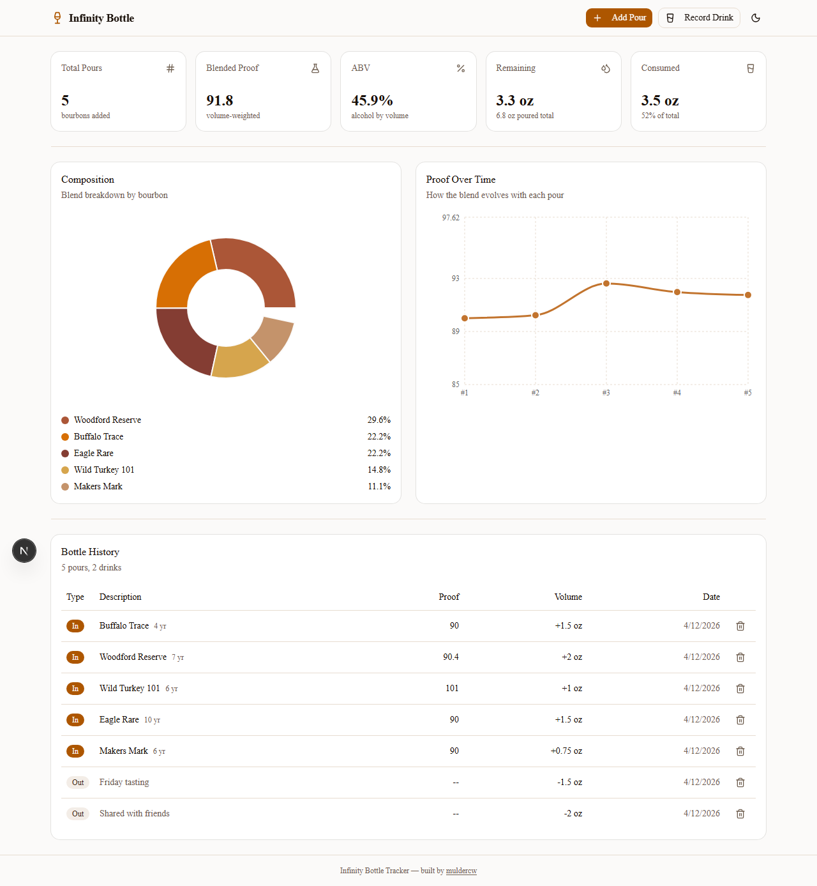
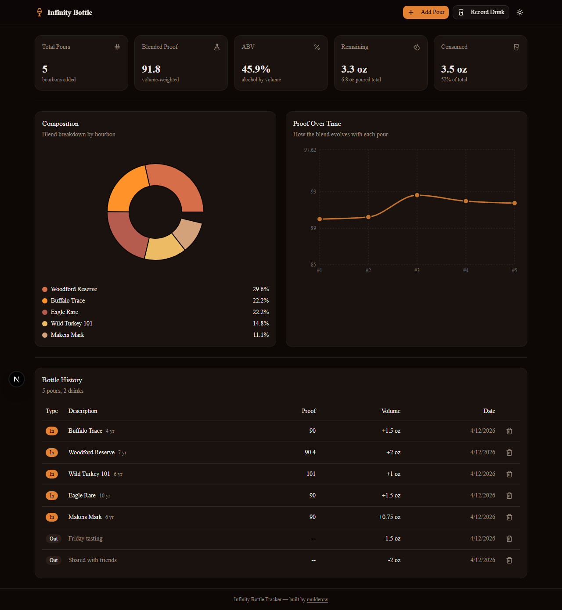

# Infinity Bottle

A cross-platform app for tracking your whiskey infinity bottle. Add pours, record drinks, watch the blended proof evolve, and see a full composition breakdown -- available on Windows, macOS, Android, iOS, and as a self-hosted Docker web app.





## Download

- **Windows** -- [Infinity.Bottle.Setup.1.0.0.exe](https://github.com/muldercw/InfinityBottleAlgo/releases/download/v1.0.0/Infinity.Bottle.Setup.1.0.0.exe)
- **macOS** -- [Infinity.Bottle.macOS.dmg](https://github.com/muldercw/InfinityBottleAlgo/releases/download/v1.0.0/Infinity.Bottle.macOS.dmg)
- **Android** -- [Infinity.Bottle.apk](https://github.com/muldercw/InfinityBottleAlgo/releases/download/v1.0.0/Infinity.Bottle.apk)
- **iOS** -- [Infinity.Bottle.iOS.zip](https://github.com/muldercw/InfinityBottleAlgo/releases/download/v1.0.0/Infinity.Bottle.iOS.zip) (simulator build, see note below)
- **Docker** -- see setup instructions below

All releases: [Releases page](https://github.com/muldercw/InfinityBottleAlgo/releases)

## Features

- **Dashboard** with summary cards showing total pours, blended proof, ABV, remaining volume, and amount consumed
- **Composition donut chart** showing the percentage breakdown of each bourbon in the blend
- **Proof timeline chart** tracking how the blended proof evolves with each pour
- **Bottle history table** showing pours (in) and drinks (out) in a unified timeline
- **Add Pour dialog** for entering bourbon name, age, proof, and volume
- **Record Drink dialog** for logging when you drink or share from the bottle, with optional notes
- **Volume tracking** that prevents you from drinking more than what remains in the bottle
- **Dark/light mode** toggle with system preference detection
- **Cross-platform** -- same design on Windows, macOS, Android, iOS, and web
- **Persistent storage** -- data survives app restarts on all platforms

## How It Works

Every time you open a new bottle, add a pour through the UI. When you drink or share from the bottle, record a drink to track the remaining volume. The app calculates the running blended proof using a volume-weighted average:

```
blended_proof = sum(each pour's proof * volume) / total_volume
```

Drawing from the bottle reduces the remaining volume but does not change the blended proof, since you are removing the already-blended liquid proportionally.

## Setup Options

### Docker (recommended for self-hosting)

```bash
git clone https://github.com/muldercw/InfinityBottleAlgo.git
cd InfinityBottleAlgo
docker compose up -d
```

The app is available at `http://localhost:3000`. Bottle data persists in a named Docker volume.

### Windows Desktop

Download the `.exe` installer from [Releases](https://github.com/muldercw/InfinityBottleAlgo/releases). Run it and the app launches as a standalone desktop window.

### macOS Desktop

Download the `.dmg` from [Releases](https://github.com/muldercw/InfinityBottleAlgo/releases). Open it and drag Infinity Bottle to your Applications folder.

### Android

Download the `.apk` from [Releases](https://github.com/muldercw/InfinityBottleAlgo/releases). Enable "Install from unknown sources" in your device settings, then install.

### iOS

The iOS build is currently an unsigned simulator build. To run on a physical device or distribute via TestFlight/App Store, an Apple Developer account is required. The Capacitor iOS project is fully set up and ready to sign.

### Local Development

```bash
npm install
npm run dev
```

The dev server runs at `http://localhost:3000`.

## Building from Source

```bash
# Static web export (used by desktop and mobile builds)
npm run build:static

# Windows installer
npm run build:electron

# macOS DMG (must run on macOS)
npx electron-builder --mac --config electron-builder.yml

# Android APK (requires Android SDK)
npm run build:static && npx cap sync android
cd android && ./gradlew assembleDebug

# iOS (requires macOS with Xcode)
npm run build:static && npx cap sync ios
cd ios/App && xcodebuild -workspace App.xcworkspace -scheme App -sdk iphonesimulator
```

## Tech Stack

- [Next.js](https://nextjs.org/) (App Router)
- [shadcn/ui](https://ui.shadcn.com/) (component library)
- [Recharts](https://recharts.org/) (charts)
- [Tailwind CSS](https://tailwindcss.com/) (styling)
- [Electron](https://www.electronjs.org/) (Windows and macOS desktop)
- [Capacitor](https://capacitorjs.com/) (Android and iOS)

## What Is an Infinity Bottle?

An infinity bottle is a whiskey enthusiast tradition. Every time you open a new bottle of bourbon, scotch, or any whiskey, you pour a small amount into a shared vessel. Over months or years, the blend becomes a layered, one-of-a-kind spirit that tells the story of everything you have tasted. The bottle is never finished -- you keep topping it up.

## License

Apache License 2.0 -- see [LICENSE](LICENSE) for details.

Copyright 2023 muldercw. You must give appropriate credit to the original author when using or redistributing this software.
